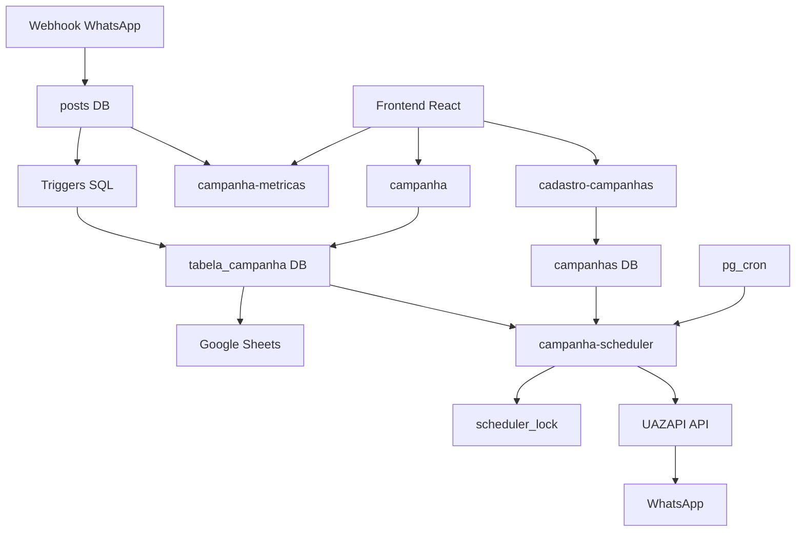
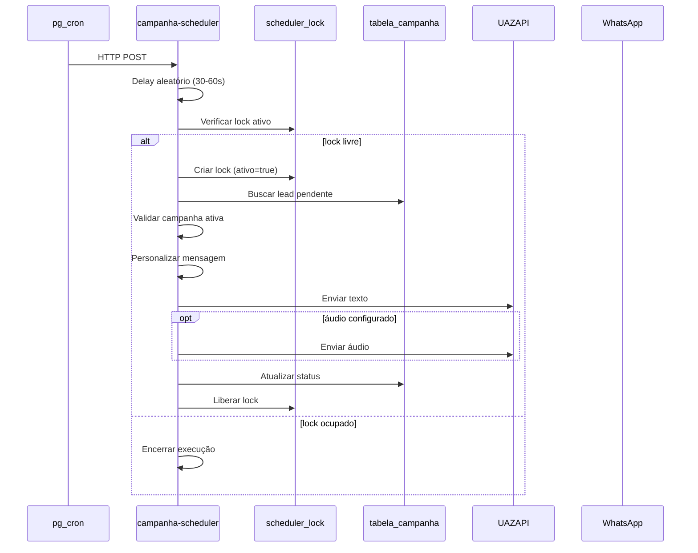
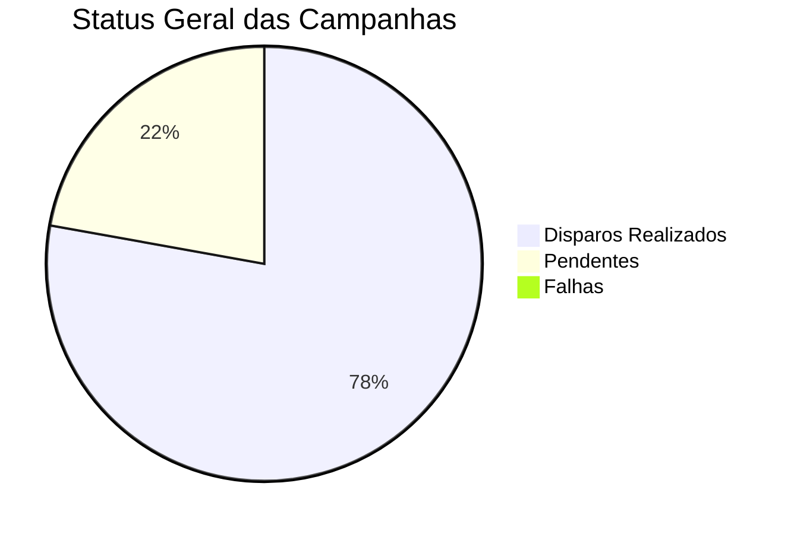

# Sistema Completo de Disparo de Campanhas WhatsApp

Este documento descreve a arquitetura completa do sistema de disparo de campanhas via WhatsApp, incluindo estrutura de dados, Edge Functions, agendamento, métricas e integrações visuais.

## 📋 Overview do Sistema



## 🏗️ Arquitetura de Componentes

### Banco de Dados (PostgreSQL)
```sql
-- Tabelas principais do sistema
campanhas              -- Metadados das campanhas
tabela_campanha        -- Leads e status de disparo  
scheduler_lock         -- Controle de concorrência
posts                  -- Mensagens recebidas (CRM)
```

### Edge Functions (Supabase)
```typescript
campanha              -- Ingestão/consulta de leads
campanha-scheduler    -- Motor de disparo automático
campanha-metricas     -- Cálculo de métricas
cadastro-campanhas    -- CRUD de campanhas
```

### Agendamento
```sql
-- pg_cron: 3 jobs para alta disponibilidade
jobid 19: */3 minutos
jobid 20: */5 minutos  
jobid 21: */7 minutos
```

---

## 📊 Estrutura de Dados

### `campanhas` - Configuração das Campanhas
| Campo | Tipo | Descrição |
|-------|------|-----------|
| `id` | text | Identificador único |
| `nome` | text | Nome da campanha |
| `mensagem_template` | text | Template com placeholders |
| `status` | text | 'ativa' \| 'pausada' \| 'finalizada' |
| `enviar_audio_vazio` | boolean | Envia áudio após texto |
| `arquivo_audio_personalizado` | text | URL do áudio customizado |
| `created_at` | timestamptz | Data de criação |

### `tabela_campanha` - Leads da Campanha
| Campo | Tipo | Descrição |
|-------|------|-----------|
| `id` | integer | PK auto-increment |
| `ID_campanha` | text | FK para campanhas.id |
| `nome` | varchar | Nome do lead |
| `telefone` | varchar | WhatsApp (formatado) |
| `disparo_feito` | boolean | true=enviado, null=pendente |
| `extras` | jsonb | Dados extendidos e erros |
| `criado_em` | timestamptz | Data de criação |
| `agendado_para` | timestamptz | Agendamento inicial |

### `scheduler_lock` - Controle de Concorrência
| Campo | Tipo | Descrição |
|-------|------|-----------|
| `id` | integer | PK fixa (1) |
| `ativo` | boolean | Execução em andamento |
| `inicio` | timestamptz | Início da execução |
| `fim` | timestamptz | Fim da execução |
| `source` | text | Origem (job-3min/5min/7min) |

---

## 🔧 Edge Functions Detalhadas

### 1. `campanha` - Gestão de Leads
**Endpoints:**
- `GET /functions/v1/campanha` - Lista leads
- `POST /functions/v1/campanha` - Adiciona lead

**Funcionalidades:**
- ✅ Normalização de telefones (DDI 55)
- ✅ Validação de dados obrigatórios
- ✅ Sincronização com Google Sheets
- ✅ Formatação de payload para integrações

### 2. `campanha-scheduler` - Motor de Disparo
**Fluxo de Execução:**


### 3. `campanha-metricas` - Sistema de Métricas
**Cálculos Implementados:**
- 📊 Total de leads por campanha
- 📈 Disparos realizados vs pendentes
- ✅ Taxa de respostas (cruzamento com posts)
- ❌ Falhas e erros de envio
- ⏱️ Tempo médio de processamento

**Visualizações no Frontend:**
```typescript
// Cards de métricas por campanha
interface CampanhaCard {
  total_leads: number
  disparos_feitos: number
  responderam: number
  nao_responderam: number
  falharam: number
  pendentes: number
}
```

### 4. `cadastro-campanhas` - CRUD de Campanhas
**Operações:**
- `GET` - Listar campanhas
- `POST` - Criar campanha
- `PATCH` - Atualizar campanha
- `DELETE` - Remover campanha

---

## 📱 Integração UAZAPI

### Métodos de Envio Disponíveis

#### 1. Envio de Mensagem de Texto
```typescript
// Endpoint: /send/text
const payload = {
  number: "55319XXXXXXXX",  // Telefone formatado
  text: "Mensagem personalizada"
}

const response = await fetch(UAZAPI_CONFIG.url, {
  method: 'POST',
  headers: {
    'Accept': 'application/json',
    'Content-Type': 'application/json',
    'token': UAZAPI_CONFIG.token  // Configurado via env
  },
  body: JSON.stringify(payload)
})
```

#### 2. Envio de Mídia (Áudio)
```typescript
// Endpoint: /send/media
const payload = {
  number: "55319XXXXXXXX",
  type: 'audio',
  file: "https://url-do-audio.mp3"  // Áudio padrão ou customizado
}

const response = await fetch(UAZAPI_CONFIG.mediaUrl, {
  method: 'POST',
  headers: {
    'Accept': 'application/json',
    'Content-Type': 'application/json',
    'token': UAZAPI_CONFIG.token
  },
  body: JSON.stringify(payload)
})
```

### Configuração UAZAPI
```typescript
const UAZAPI_CONFIG = {
  url: 'https://oralaligner.uazapi.com/send/text',
  mediaUrl: 'https://oralaligner.uazapi.com/send/media',
  token: process.env.UAZAPI_TOKEN,  // Variável de ambiente
  maxRetries: 3
}
```

### Normalização de Telefones
```typescript
function formatarTelefoneParaEnvio(telefone: string): string {
  let telefoneLimpo = telefone.replace(/\D/g, '')
  telefoneLimpo = telefoneLimpo.replace(/^0+/, '')
  
  if (!telefoneLimpo.startsWith('55')) {
    telefoneLimpo = `55${telefoneLimpo}`
  }
  
  return telefoneLimpo
}
```

---

## 📈 Sistema de Métricas e Visualizações

### Dashboard Principal


### Métricas por Campanha
- 📊 **Total Leads**: Todos os leads atribuídos
- 📤 **Disparos Feitos**: Mensagens enviadas com sucesso
- ⏳ **Pendentes**: Aguardando processamento
- ✅ **Responderam**: Leads que interagiram
- ❌ **Não Responderam**: Sem resposta após disparo
- 🚫 **Falharam**: Erros no envio

### Cálculo de Taxas
```typescript
const taxas = {
  taxa_disparo: (disparos_feitos / total_leads) * 100,
  taxa_resposta: (responderam / disparos_feitos) * 100,
  taxa_falha: (falharam / total_leads) * 100
}
```

### Visualização Kanban
O sistema inclui um board Kanban para gestão de leads:
- 🟡 **Não Respondeu**: Leads sem interação
- 🟢 **Interagindo**: Leads em conversa ativa
- 🔴 **Em Atenção**: Leads prioritários
- 🔵 **Interessados**: Leads para agendamento
- 🟣 **Em Cadência**: Leads em follow-up

---

## ⏰ Sistema de Agendamento

### Jobs pg_cron
```sql
-- Job 19: A cada 3 minutos
SELECT cron.schedule('job-19', '0,3,6,9,12,15,18,21,24,27,30,33,36,39,42,45,48,51,54,57 * * * *', 
  $$
  SELECT net.http_post(
    url := 'https://projeto.supabase.co/functions/v1/campanha-scheduler',
    headers := '{"Content-Type": "application/json", "Authorization": "Bearer TOKEN"}'::jsonb,
    body := '{"delay_source": "job-3min"}'::jsonb
  );
  $$);

-- Job 20: Janela de 5 minutos
SELECT cron.schedule('job-20', '1,6,11,16,21,26,31,36,41,46,51,56 * * * *', 
  $$
  SELECT net.http_post(
    url := 'https://projeto.supabase.co/functions/v1/campanha-scheduler',
    headers := '{"Content-Type": "application/json", "Authorization": "Bearer TOKEN"}'::jsonb,
    body := '{"delay_source": "job-5min"}'::jsonb
  );
  $$);

-- Job 21: Janela de 7 minutos  
SELECT cron.schedule('job-21', '2,9,16,23,30,37,44,51,58 * * * *', 
  $$
  SELECT net.http_post(
    url := 'https://projeto.supabase.co/functions/v1/campanha-scheduler',
    headers := '{"Content-Type": "application/json", "Authorization": "Bearer TOKEN"}'::jsonb,
    body := '{"delay_source": "job-7min"}'::jsonb
  );
  $$);
```

### Estratégia de Lock
```typescript
// Evita execuções concorrentes
const lock = await supabase
  .from('scheduler_lock')
  .select('*')
  .eq('ativo', true)
  .single()

if (lock) {
  return { message: "Already running" }
}

// Criar lock
await supabase
  .from('scheduler_lock')
  .upsert({ 
    id: 1, 
    ativo: true, 
    inicio: new Date().toISOString(),
    source: body.delay_source
  })
```

---

## 🔄 Triggers e Automações SQL

### Triggers de Associação
```sql
-- Trigger para associar posts a campanhas
CREATE TRIGGER trigger_verificar_campanha_insert
  AFTER INSERT ON posts
  FOR EACH ROW
  EXECUTE FUNCTION verificar_e_associar_campanha();

CREATE TRIGGER trigger_verificar_campanha_update  
  AFTER UPDATE ON posts
  FOR EACH ROW
  EXECUTE FUNCTION verificar_e_associar_campanha();
```

### Funções Auxiliares
```sql
-- Verificar e associar campanha
CREATE OR REPLACE FUNCTION verificar_e_associar_campanha()
RETURNS TRIGGER AS $$
BEGIN
  -- Lógica para associar post a lead de campanha
  -- Atualizar status e métricas
  RETURN NEW;
END;
$$ LANGUAGE plpgsql;
```

---

## 🎯 Fluxo Completo de Disparo

### 1. Criação da Campanha
```
Frontend → cadastro-campanhas → campanhas (DB)
```

### 2. Ingestão de Leads
```
API/Webhook → campanha → tabela_campanha + Google Sheets
```

### 3. Processamento Automático
```
pg_cron → campanha-scheduler → UAZAPI → WhatsApp
```

### 4. Rastreamento de Respostas
```
WhatsApp → posts → triggers → métricas
```

### 5. Visualização
```
campanha-metricas → Frontend → Dashboard/Kanban
```

---

## ⚡ Performance e Escalabilidade

### Estratégias Implementadas
- 🔄 **Processamento Unitário**: 1 lead por execução (evita sobrecarga)
- ⏱️ **Delay Aleatório**: Distribui carga ao longo do tempo
- 🔒 **Lock Concorrente**: Evita duplicidade de processamento
- 📊 **Cache de Métricas**: Reduz consultas ao banco
- 🎯 **Índices Otimizados**: Performance em queries

### Índices Recomendados
```sql
CREATE INDEX idx_tabela_campanha_id_campanha ON tabela_campanha(ID_campanha);
CREATE INDEX idx_tabela_campanha_disparo_feito ON tabela_campanha(disparo_feito);
CREATE INDEX idx_tabela_campanha_criado_em ON tabela_campanha(criado_em);
CREATE INDEX idx_posts_telefone ON posts(telefone);
CREATE INDEX idx_scheduler_lock_ativo ON scheduler_lock(ativo);
```

---

## 🚨 Monitoramento e Alertas

### Logs Importantes
- ✅ **Sucesso de Disparo**: Lead processado e enviado
- ❌ **Falhas**: Erros de API, telefone inválido, etc.
- ⏱️ **Performance**: Tempo de execução do scheduler
- 🔒 **Lock**: Execuções concorrentes detectadas

### Métricas de Saúde
```typescript
const healthCheck = {
  scheduler_ativo: lock?.ativo || false,
  leads_pendentes: countLeadsPendentes(),
  ultima_execucao: lock?.inicio,
  taxa_erro: calculateErrorRate(),
  throughput: calculateThroughput()
}
```

---

## 🔧 Configuração e Deploy

### Variáveis de Ambiente
```env
SUPABASE_URL=your-project.supabase.co
SUPABASE_ANON_KEY=anon_key
SUPABASE_SERVICE_ROLE_KEY=service_key
UAZAPI_TOKEN=token_from_uazapi
GOOGLE_SHEETS_WEBHOOK=apps_script_url
```

### Deploy de Edge Functions
```bash
# Deploy das funções
supabase functions deploy campanha
supabase functions deploy campanha-scheduler  
supabase functions deploy campanha-metricas
supabase functions deploy cadastro-campanhas
```

---

## 📋 Checklist de Troubleshooting

### Disparos Não Funcionando
1. ✅ Campanha está `status = 'ativa'`?
2. ✅ Leads pendentes em `tabela_campanha`?
3. ✅ `scheduler_lock` não está preso?
4. ✅ Jobs pg_cron estão ativos?
5. ✅ Edge Functions deployadas?
6. ✅ Token UAZAPI válido?

### Métricas Não Atualizando
1. ✅ Triggers SQL funcionando?
2. ✅ Cross-reference de telefones correto?
3. ✅ Cache de métricas expirou?
4. ✅ Permissões RLS configuradas?

### Performance Lenta
1. ✅ Índices criados?
2. ✅ Queries otimizadas?
3. ✅ Cache implementado?
4. ✅ Pool de conexões adequado?

---

## 🎓 Resumo Executivo

O sistema de disparo de campanhas é uma solução completa e escalável para envio automatizado de mensagens WhatsApp, com:

- 🏗️ **Arquitetura robusta**: PostgreSQL + Edge Functions + pg_cron
- 📱 **Integração UAZAPI**: Envio confiável de textos e áudios
- 📊 **Métricas em tempo real**: Dashboard completo com visualizações
- 🔄 **Automação total**: Do lead ao disparo sem intervenção manual
- 🚀 **Alta disponibilidade**: Múltiplos jobs e controle de concorrência
- 📈 **Escalável**: Processamento controlado e monitorado

Este documento serve como referência técnica completa para desenvolvimento, manutenção e evolução do sistema.

---
